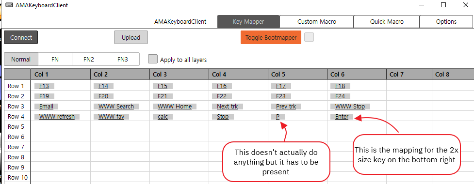

# koolertron
Koolertron Configuration and Autohotkey Macro Programming

# Configuration Files

|File | Description |
| ---   | ---   |
| /json/keyindex.json  | list of keys to display on mapping screen  |

# Initial Configuration

1. Install/Unzip **Amag** Software

2. **Enable the F13..F24 keys in the layout**. Edit the `json\keyindex.json` file to add the keys. In my case, this was inserting after line **1338**, but just preserve the valid **json** formatting and you should be fine.

```json
  ,
 {
"keyIndex": 145,
"marginBottom": 0,
  "width": 1,
  "height": 1,
  "marginRight": 0,
  "label": "F13"
},
{
  "keyIndex": 146,
  "marginBottom": 0,
  "width": 1,
  "height": 1,
  "marginRight": 0,
  "label": "F14"
},
{
  "keyIndex": 147,
  "marginBottom": 0,
  "width": 1,
  "height": 1,
  "marginRight": 0,
  "label": "F15"
},
{
  "keyIndex": 148,
  "marginBottom": 0,
  "width": 1,
  "height": 1,
  "marginRight": 0,
  "label": "F16"
},
{
  "keyIndex": 149,
  "marginBottom": 0,
  "width": 1,
  "height": 1,
  "marginRight": 0,
  "label": "F17"
},
{
  "keyIndex": 150,
  "marginBottom": 0,
  "width": 1,
  "height": 1,
  "marginRight": 0,
  "label": "F18"
},
{
  "keyIndex": 151,
  "marginBottom": 0,
  "width": 1,
  "height": 1,
  "marginRight": 0,
  "label": "F19"
},
{
  "keyIndex": 152,
  "marginBottom": 0,
  "width": 1,
  "height": 1,
  "marginRight": 0,
  "label": "F20"
},
{
  "keyIndex": 153,
  "marginBottom": 0,
  "width": 1,
  "height": 1,
  "marginRight": 0,
  "label": "F21"
},
{
  "keyIndex": 154,
  "marginBottom": 0,
  "width": 1,
  "height": 1,
  "marginRight": 0,
  "label": "F22"
},
{
  "keyIndex": 155,
  "marginBottom": 0,
  "width": 1,
  "height": 1,
  "marginRight": 0,
  "label": "F23"
},
{
  "keyIndex": 156,
  "marginBottom": 0,
  "width": 1,
  "height": 1,
  "marginRight": 0,
  "label": "F24"
}
```

# Mapping Notes




# Mapping Constants


# Resources

* [Keyboard mapping guide](https://www.youtube.com/watch?v=2p3op87OGic)
* [BootMapper Configuration](https://www.reddit.com/r/MechanicalKeyboards/comments/9pzf6z/bootmapper_client_questions/)
* [Programming with Bootmapper](https://drop.com/talk/1392/programming-kbd-keyboards-via-bootmapper-client-tmk-guide-getting-added-soon-here)
